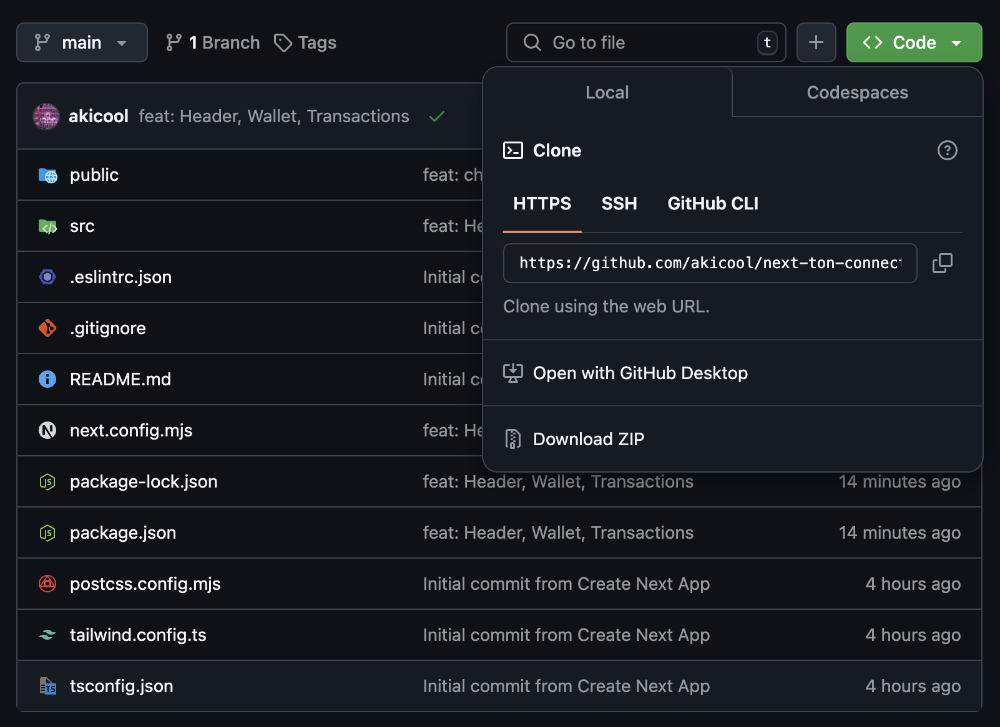
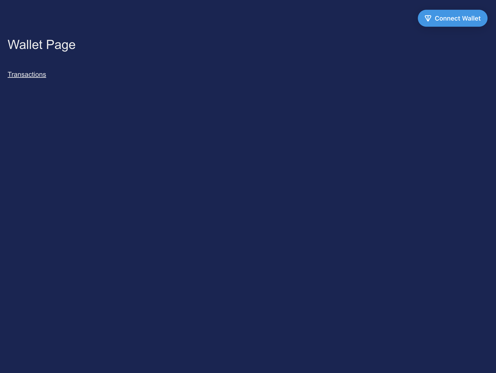
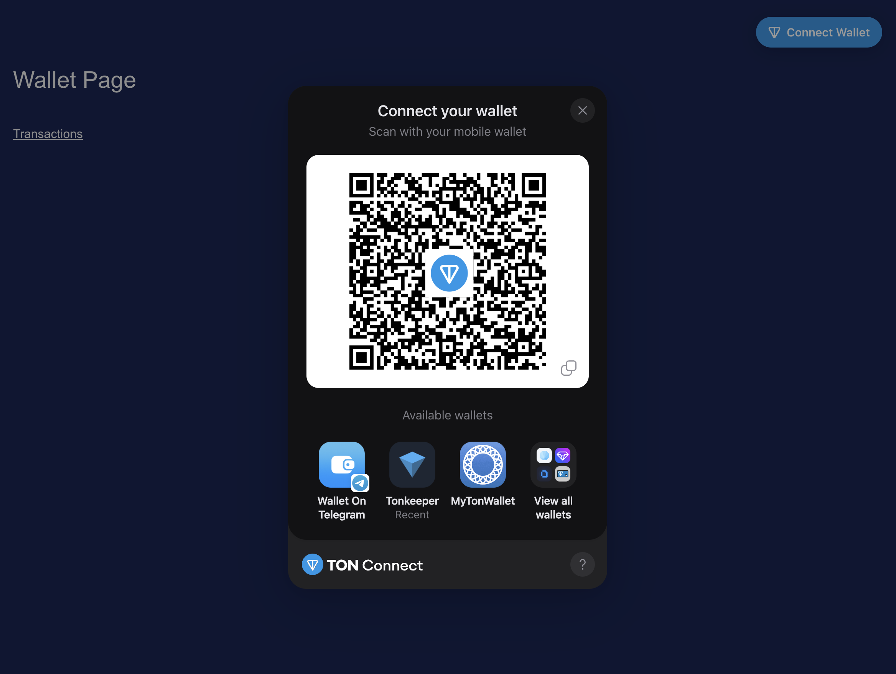
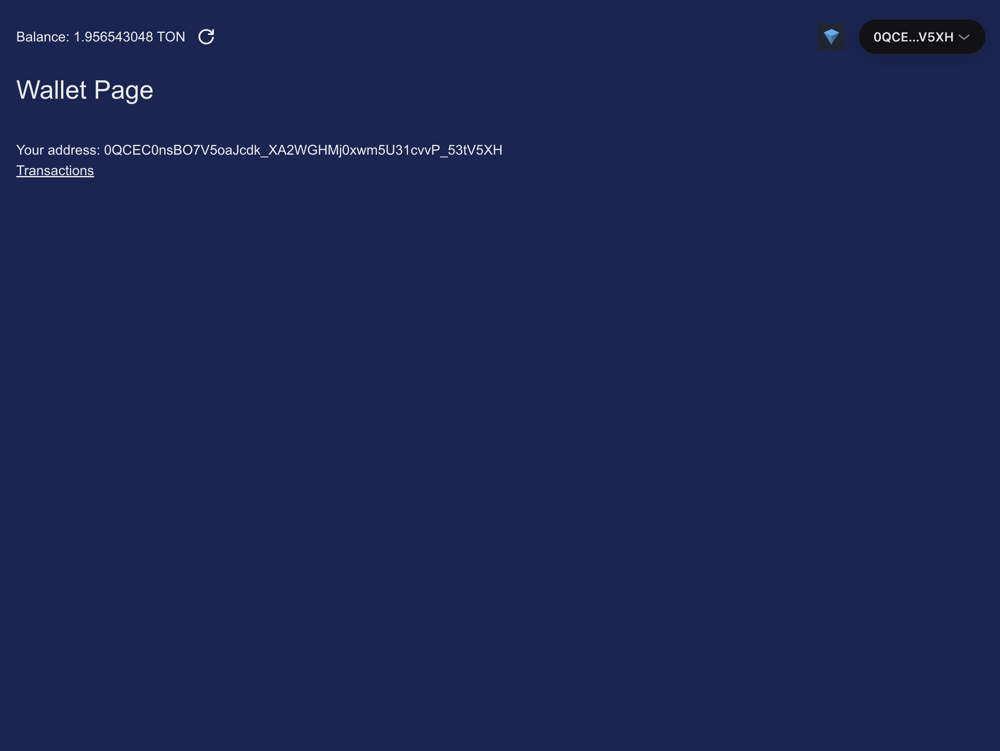
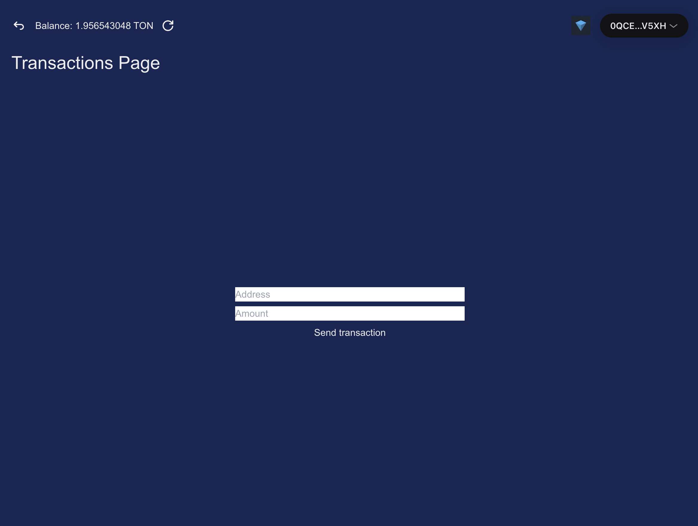

## Как развернуть проект

> - Перейдите в редактор кода и в терминале: git clone <your_copied_link>
> - Перейдите в директорию проекта и в терминал введите: npm i
> - После установки пакетов зависимостей введите в терминал: npm run dev
> - Перейдите по ссылке: http://localhost:3000

## Как пополнить кошелек

> - Нажмите на Connect Wallet
> - 
> - Выберите Tonkeeper
> - Отсканируйте QR-код из приложения Tonkeeper
> - В приложении нажмите "Connect wallet" и введите пароль

> - 
> - Первое поле - для ввода адреса, куда будем отправлять средства
> - Второе поле - для ввода количества средств (в нанотонах)
> - Отправляем средства по кнопке "Send transaction"
> - После обновите баланс
